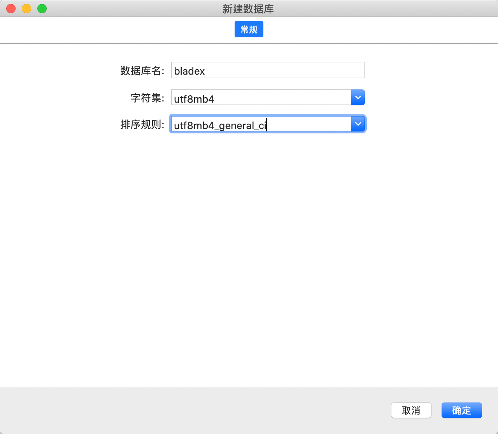
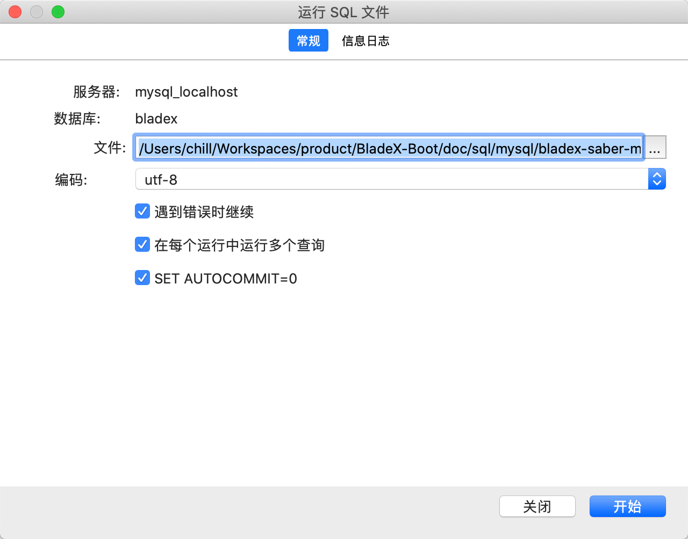
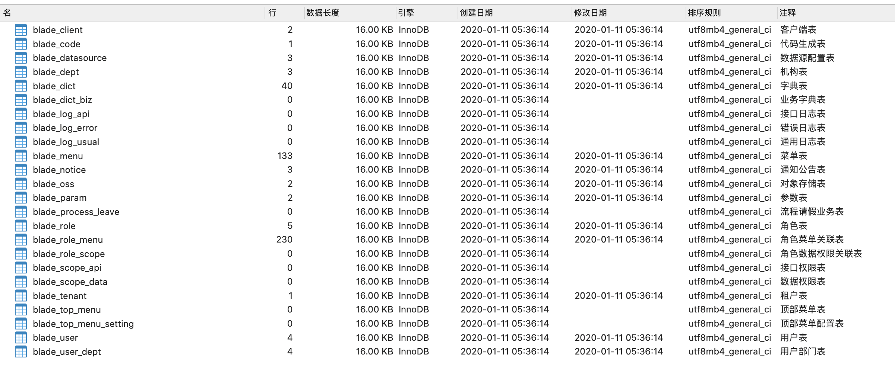
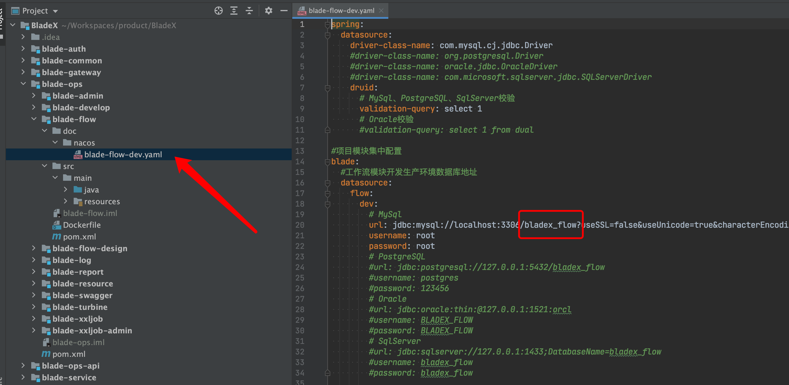
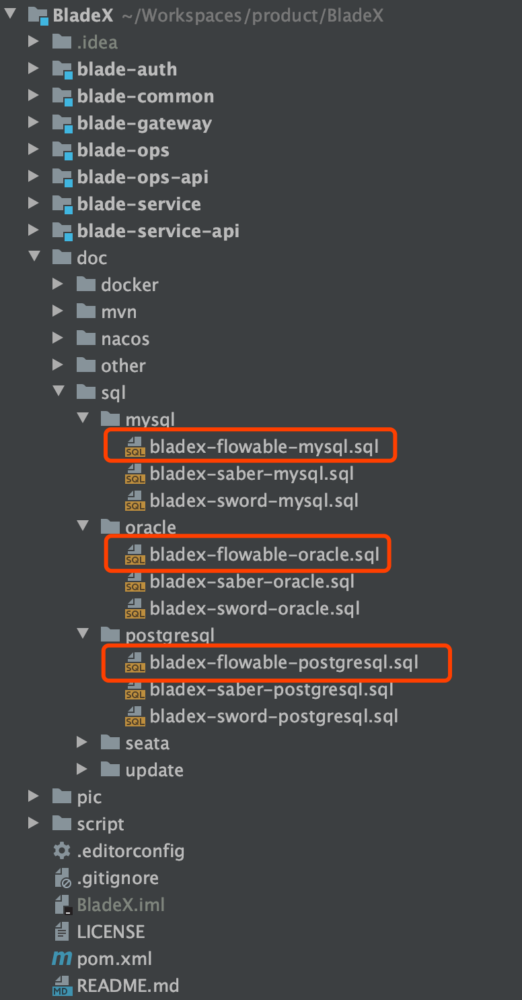

## 核心数据库导入 
1. 打开Navicat（此处可以选择其他的客户端），新建一个数据库bladex或bladex_boot(根据使用cloud还是boot来定)，也可以自行定义数据库名然后修改工程的数据库配置

2. 找到BladeX或者BladeX-Boot工程doc->sql文件夹下的sql脚本 （若前端使用saber则使用带saber的sql，反之用sword）

3. 右键运行对应的sql脚本

4. 刷新数据库，查看对应的表

5. 挑选一张表打开查看，正确无误说明数据导入成功

6. 若是导入postgresql或者oracle，流程大同小异，这里不再赘述，相信大家可以自行解决

## 工作流数据库导入

1. 工作流脚本位置如下，导入方式与上一节一致，**注意cloud版本需要新建一个bladex_flow库，boot版本需要导入在同一个库内**

  

  
  

2. 需要确定好工作流对应的数据源、数据库名等等配置，这些大家可以在配置文件灵活定义。

3. 工作流具体使用请看 5.6 章节，boot版本若不需要工作流，如何排除请看 5.6.4 章节
