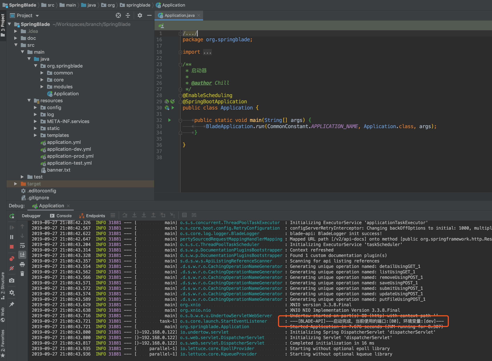
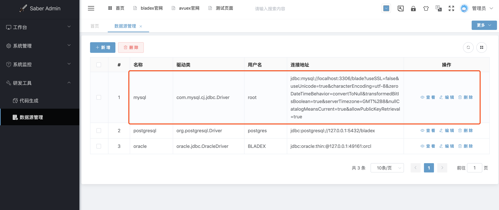
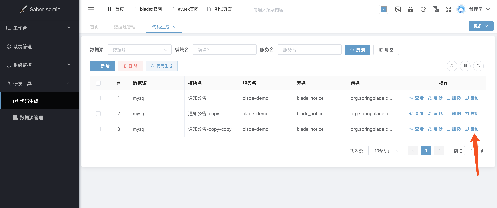
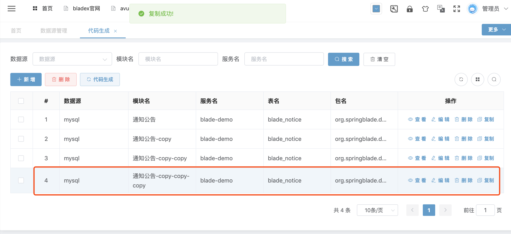
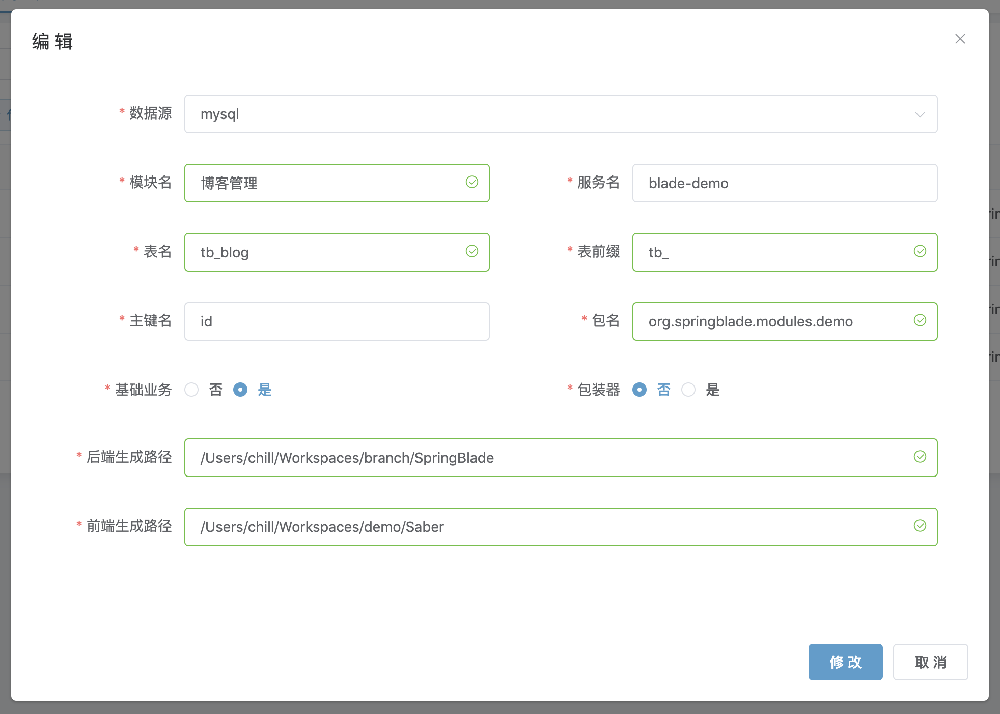
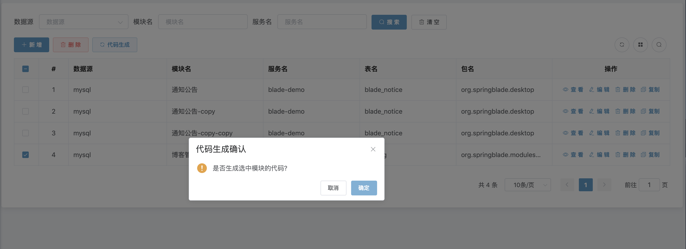
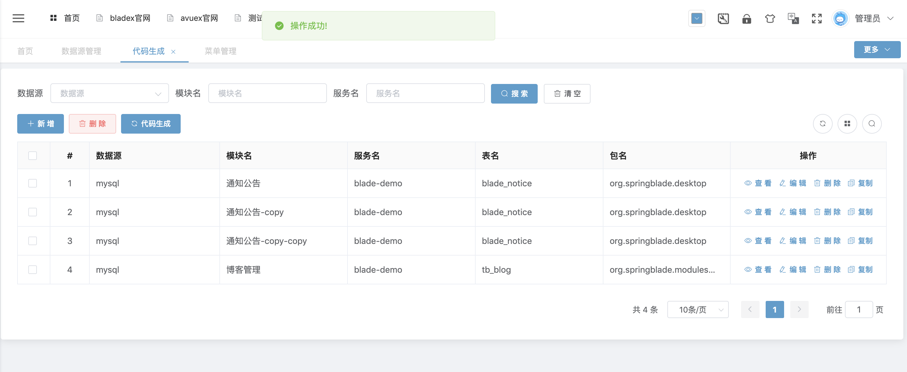
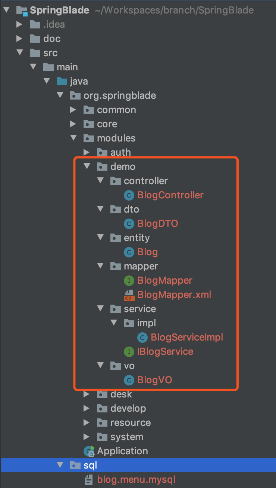
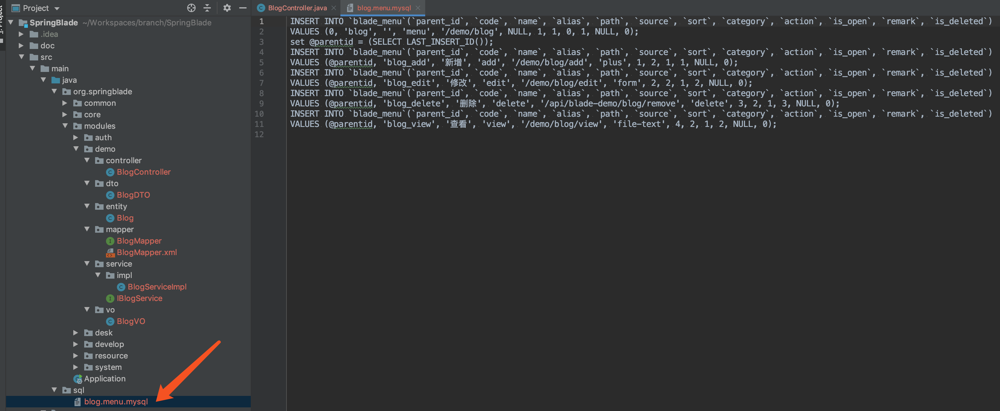
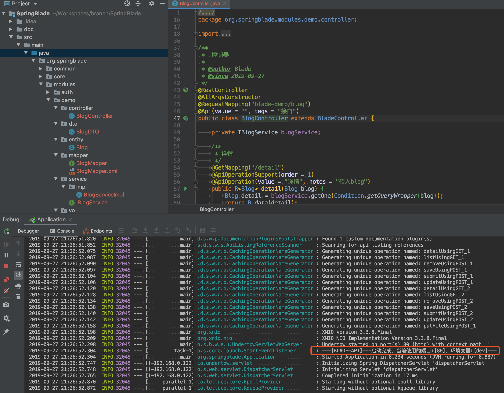

## 代码生成配置

1.  重启后端工程  
   
2.  打开前端`研发工具`\->`数据源管理`配置数据源  

3.  打开前端`研发工具`\->`代码生成`配置代码生成方案
4.  为了快速配置，我们可以点击复制按钮  
   
5.  对复制出来的配置进行修改  
   
   
6.  下面对各个属性进行讲解

*   数据源：在数据源管理中的配置，用于选择从对应的库获取数据
*   模块名：用于指定配置的名称，对代码生成不产生实际效果
*   服务名：生成后，controller对应的前缀，以及分割`-`符号后面的字符串作为前端的分包名
*   表名：用于代码生成所对应的表名称
*   表前缀：生成实体类的时候，忽略掉的前缀，若不配置，则`tb_blog`表生成的实体为`TbBlog`，若配置了`tb_`为前缀，则生成的实体为Blog
*   主键名：表的主键名称
*   包名：生成后端代码所在的包
*   基础业务：如果选择是，则实体会继承`BaseEntity`，带有上一章红框的基础业务字段
*   包装器：在某些复杂的模块，会用到`VO`和`Wrapper`，如果选择是则会自行生成
*   后端生成路径：后端工程的根目录
*   前端生成路径：前端工程的根目录

## 执行代码生成

1.  选择刚刚的配置，点击代码生成  
   
   
2.  查看后端代码，发现已经按照我们的配置，生成了后端的整套代码  
   
3.  同时生成了一个菜单的sql文件，将增删改查整个模块的sql脚本都生成好了（因为我们之前已经手动建好了对应的菜单，所以这次无需执行脚本，将其删掉即可）  
  
4.  再次重启后端代码  
   
5.  后端已经搞定，我们下一章来看一下前端的配置
