## 优化前端效果

1.  点击新增，发现都为text类型，时间不是组件，内容也不是文本域，还多处了主键字段。  
 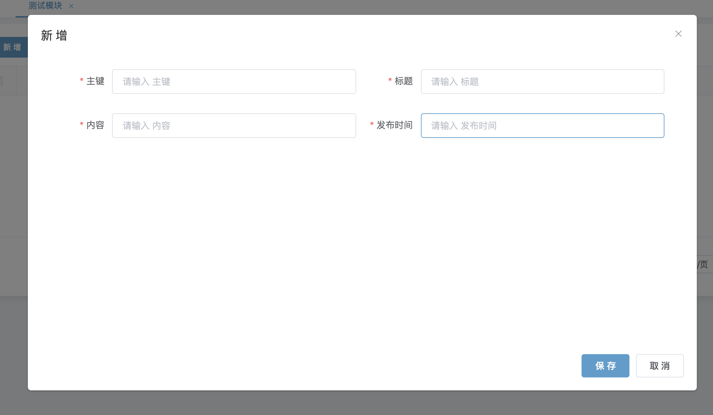
2.  因为代码生成默认的表单控件属性为text，所以针对一些组件，我们需要进行手动配置，就这个模块而言，我们需要删掉id和配置content字段和time字段的组件属性  
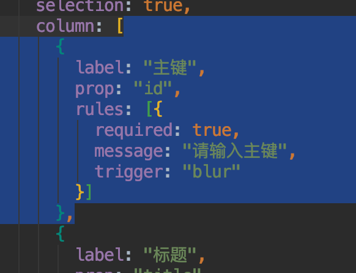 
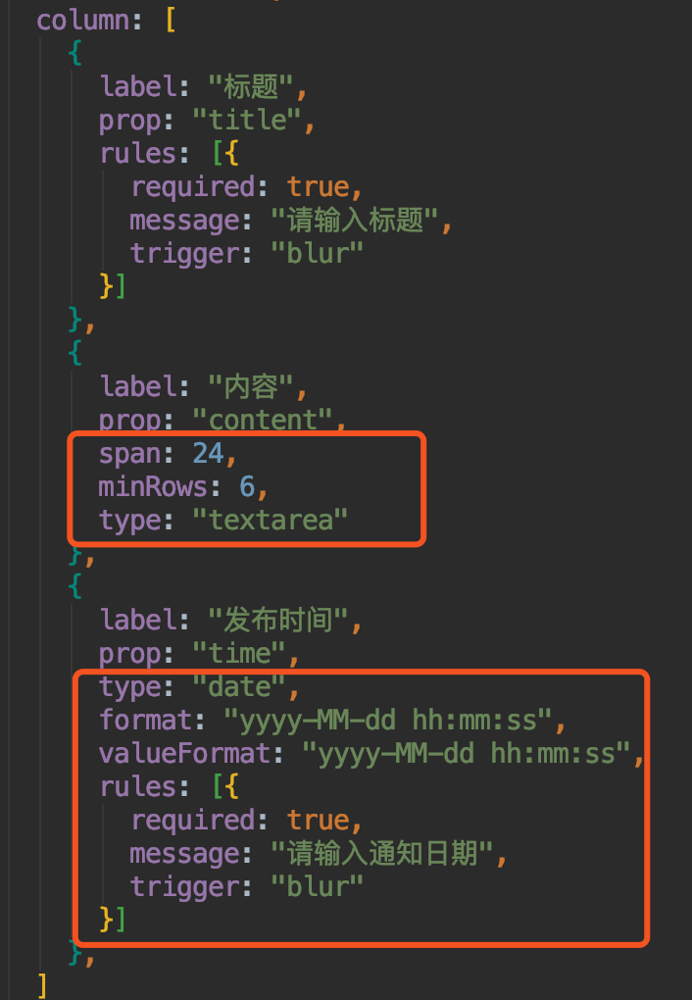
3.  刷新页面再次打开新增，发现组件类型正确，但是布局并不是很好看  
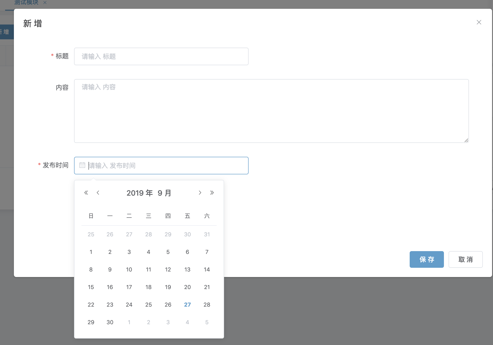
4.  我们把时间挪上去，发现排列美观了  
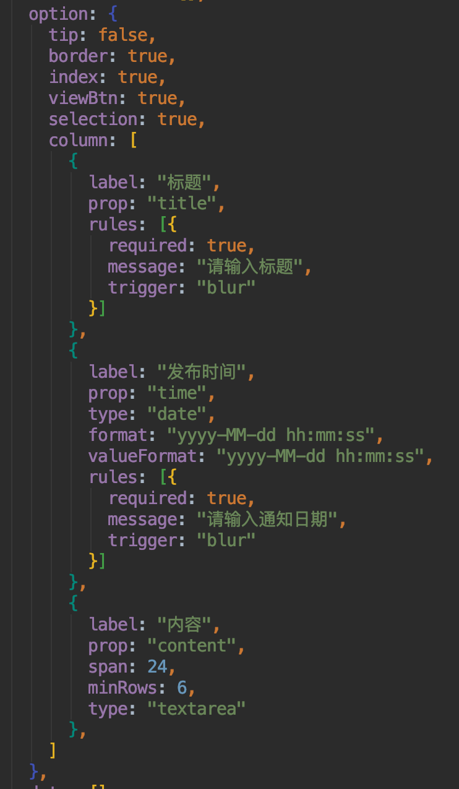
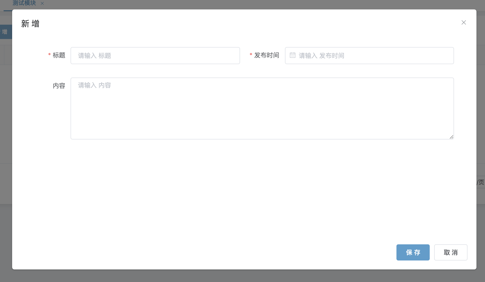
5.  如果想每个控件占用一行，我们可以如此配置  
 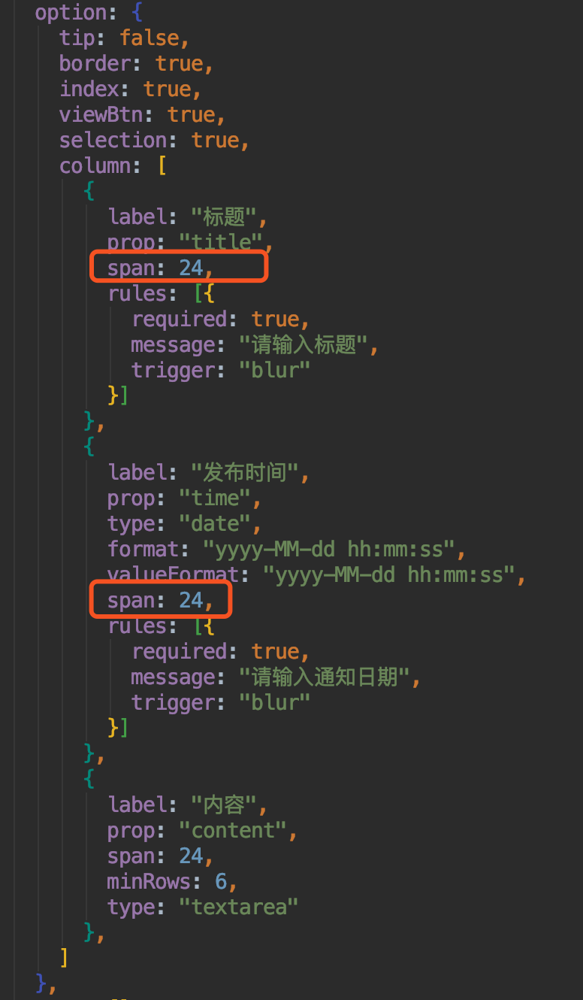
 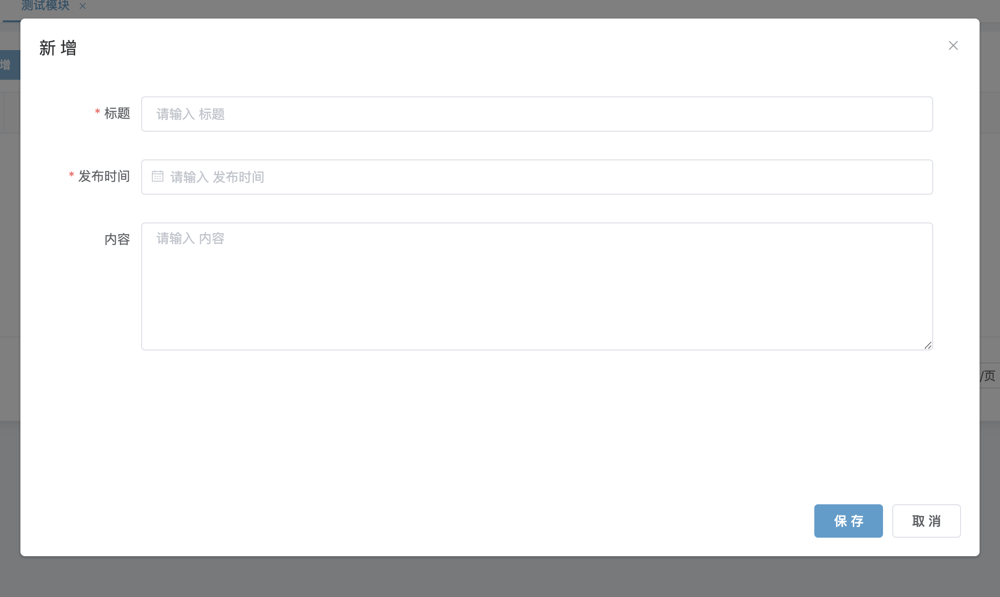
6.  如果觉得弹框太高，我们可以进行高度设置  
  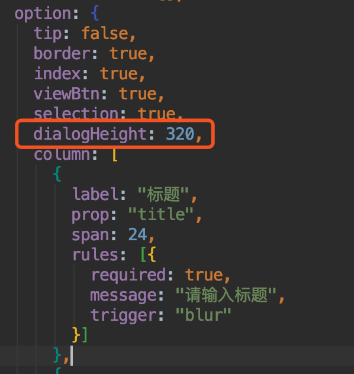
  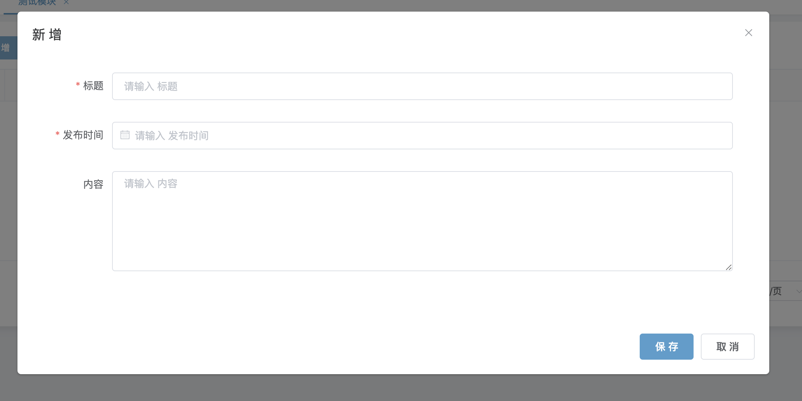
7.  这样一来，界面就美观多了

## 新增测试

*   输入相应的值，点击保存，提示成功  
  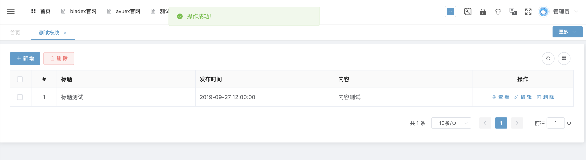

## 查看测试

*   点击查看，数据加载无误  
   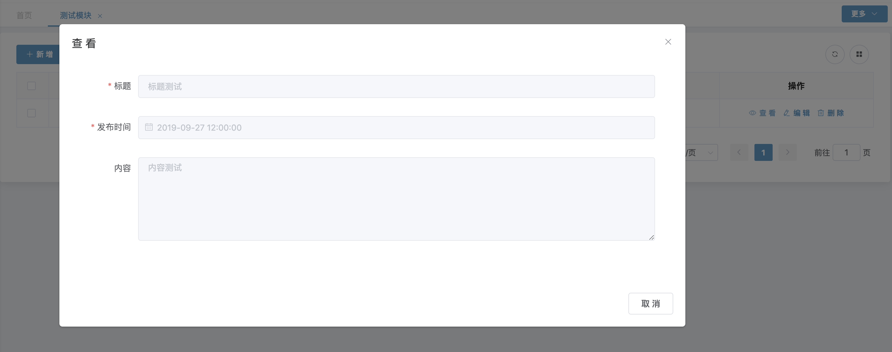

## 编辑测试

*   点击编辑，并修改一条数据，修改也成功  
  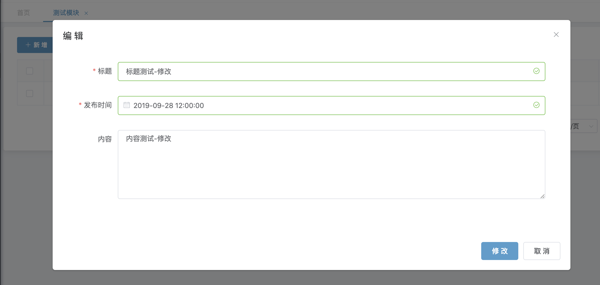 
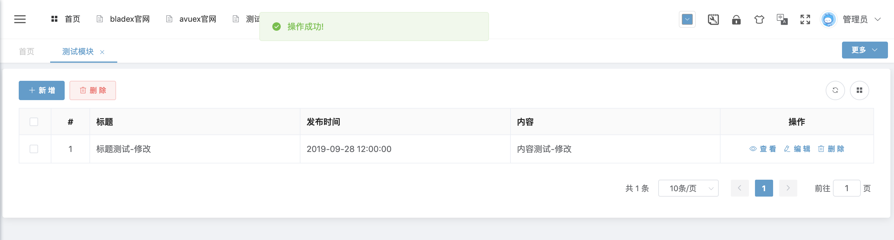

## 删除测试

*   将刚刚新增的数据删除，提示成功  
 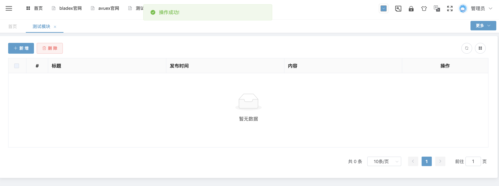

## 分页测试

*   手动新增11条数据，发现分页成功  
  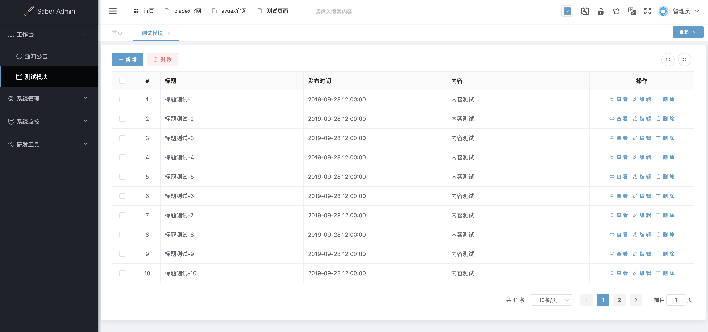
  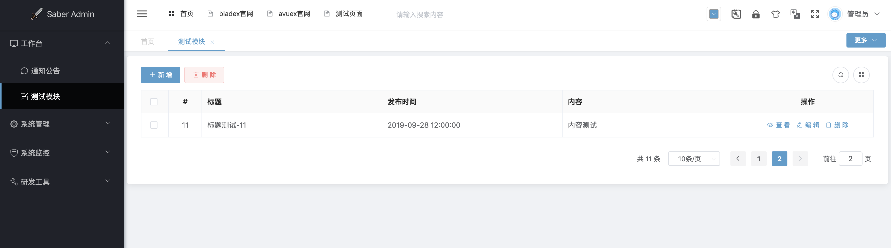

## 查询测试

*   在标题的字段上增加属性  
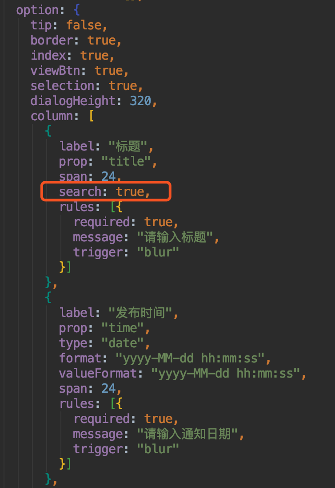
*   刷新页面，可以看到出现了对应的搜索框  
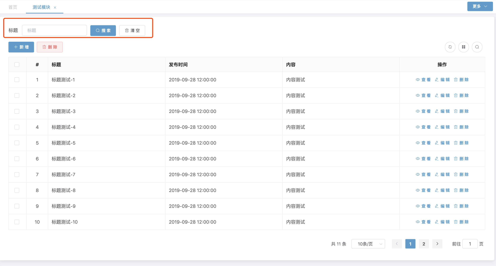
*   随意输入一个标题，点击查询，发现查询成功  
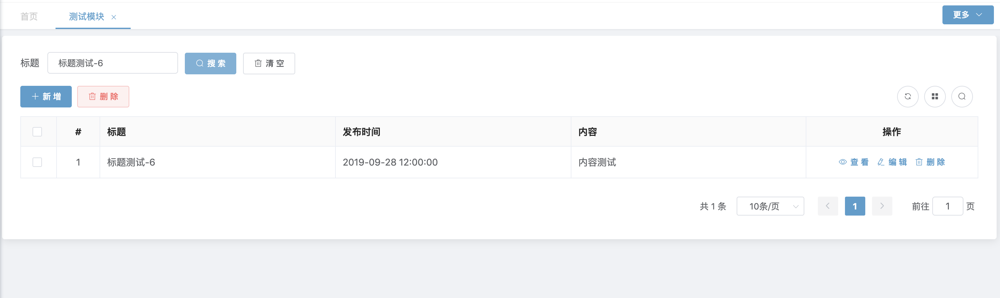

## 后记

*   由此可见，我们通过一个简单的配置，便迅速生成了前后端分离模式下的完整增删改查功能
*   文档讲解只是小部分知识点，更多的操作有待大家去发掘
*   相信大家看完SpringBlade后，会享受到更加极速的开发体验～
