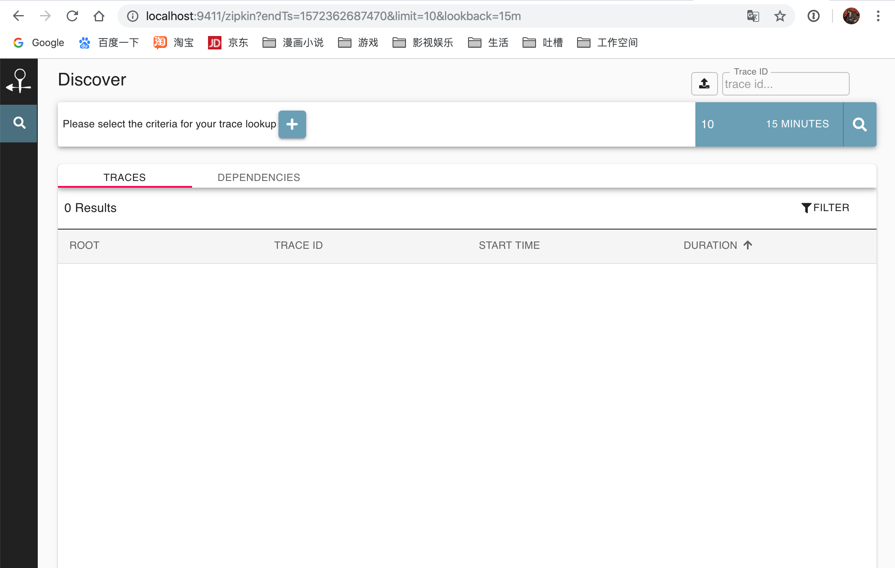
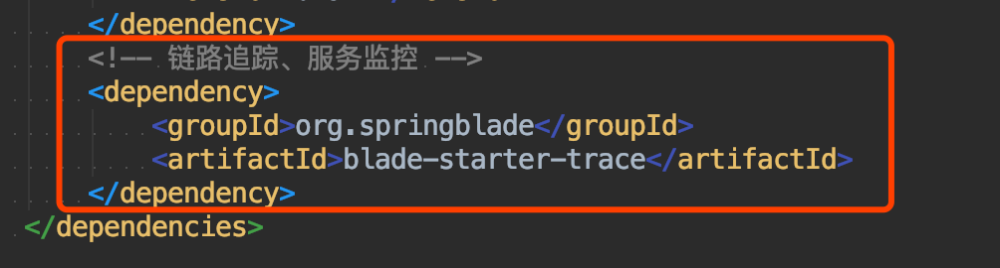
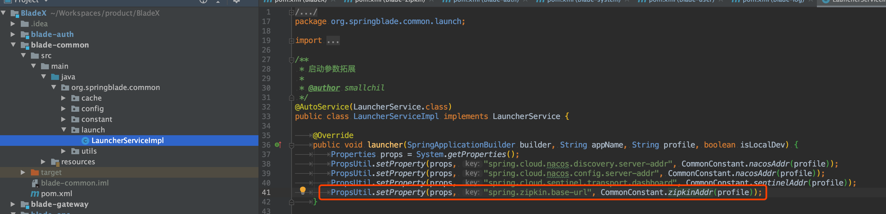
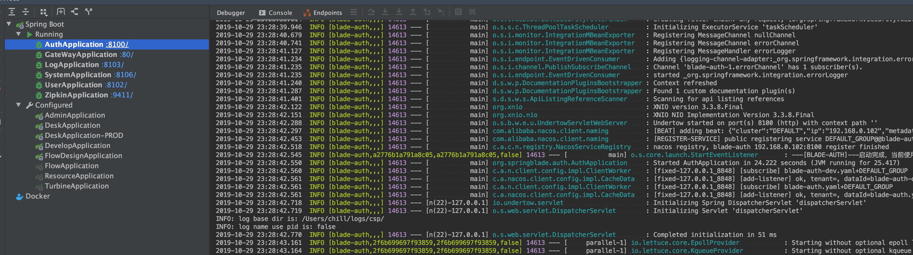
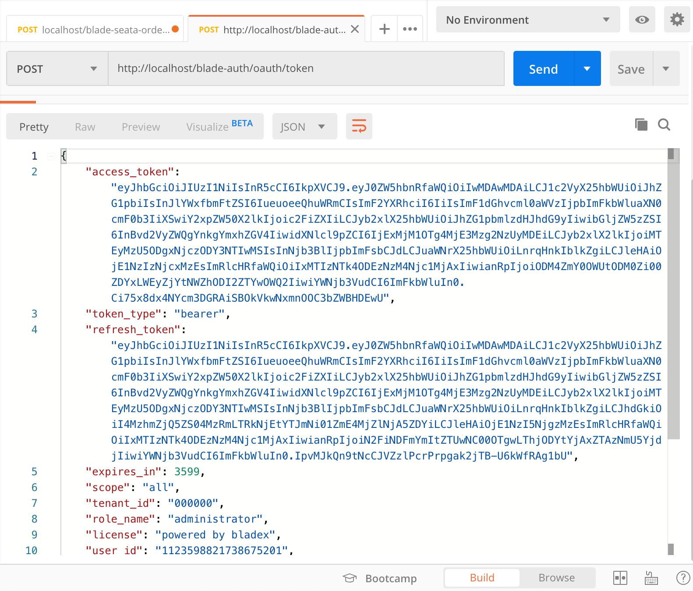
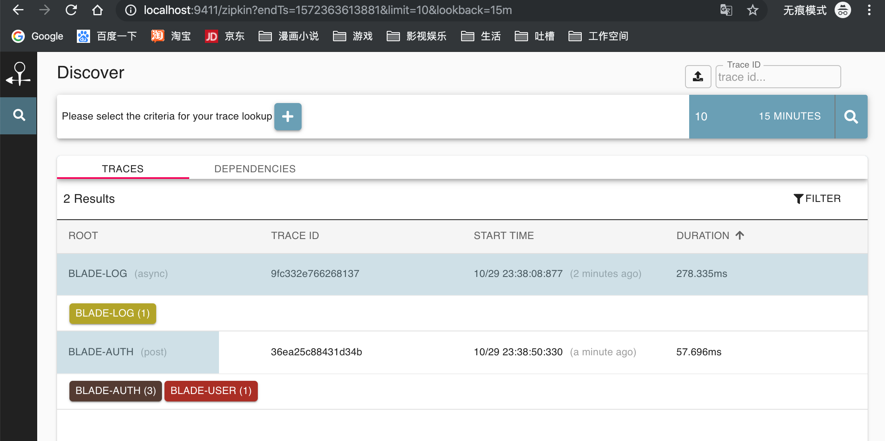
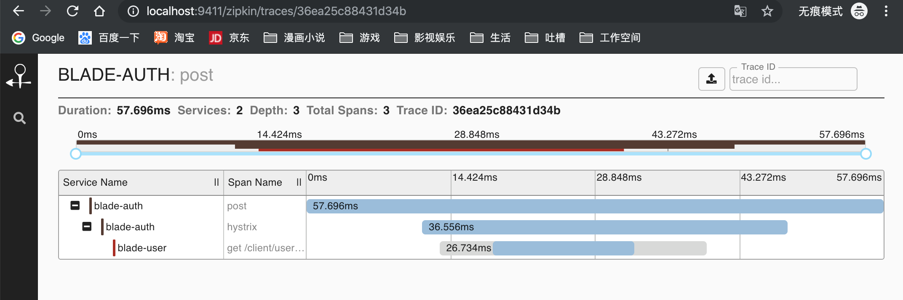

## 简介
* Zipkin是一个分布式跟踪系统。它有助于收集解决服务体系结构中的延迟问题所需的时序数据。功能包括该数据的收集和查找。
* 如果日志文件中有跟踪ID，则可以直接跳至该跟踪ID。否则，您可以基于属性进行查询，例如服务，操作名称，标签和持续时间。将为您总结一些有趣的数据，例如在服务中花费的时间百分比以及操作是否失败。

## 服务启动
1. 官网推荐方式启动详情请见：[https://zipkin.io/pages/quickstart.html](https://zipkin.io/pages/quickstart.html)
2. 访问地址查看效果：[http://localhost:9411/](http://localhost:9411/)

## 客户端对接
1. 为需要监控的服务引入依赖，目前先引入blade-auth、blade-system、blade-user、blade-log测试

2. 若zipkin地址不是默认的 http://localhost:9411，则需要自行替换

3. 启动对应的服务进行测试

4. postman调用token接口

5. 可以看到有两条记录

6. 点开blade-auth便可以看到完整的调用链

## 后记
* 有了分布式链路追踪，大家便可以在大量的服务中，方便查看每个请求所经过的调用链。
