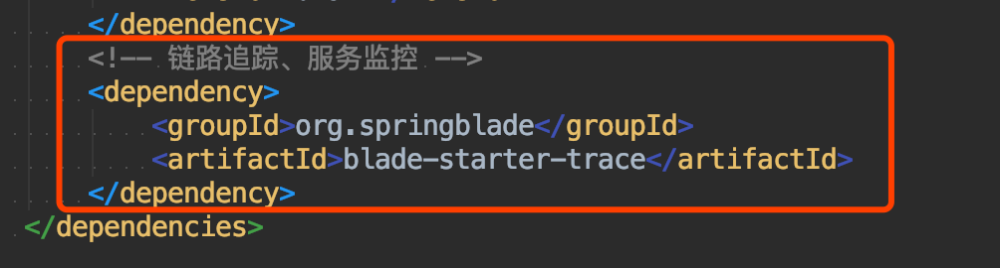

## 简介

* Turbine是聚合服务器发送事件流数据的一个工具，Hystrix的监控中，只能监控单个节点，实际生产中都为集群，因此可以通过Turbine来监控集群下Hystrix的metrics情况
* Turbine的github地址：[https://github.com/Netflix/Turbine](https://github.com/Netflix/Turbine)

## 使用场景

* 在复杂的分布式系统中，相同服务的结点经常需要部署上百甚至上千个，很多时候，运维人员希望能够把相同服务的节点状态以一个整体集群的形式展现出来，这样可以更好的把握整个系统的状态。 
* 为此，`Netflix`提供了一个开源项目`Turbine`来提供把多个  `hystrix.stream`的内容聚合为一个数据源供`Dashboard`展示。
 
## 启动服务
1. 启动之前需要先确保启动了zipkin，具体可参考上一章
2. 找到blade-ops下的blade-turbine工程，右键启动

3. 打开地址：[http://localhost:7003/hystrix](http://localhost:7003/hystrix)

## 客户端对接
1. 为需要监控的服务引入依赖，目前先引入blade-auth、blade-system、blade-user、blade-log测试

2. 目前以blade-auth为例，在hystrix dashboard下填入对应的链接：http://192.168.0.102:8100/actuator/hystrix.stream 

3. 多次调用postman，不断执行，可以看到曲线逐渐提高

4. 直接访问http://192.168.0.102:8100/actuator/hystrix.stream ，也可以直观地看到对应的信息

## 后记
* turbine接入很方便，后续大家可自行定制拓展相关的功能
