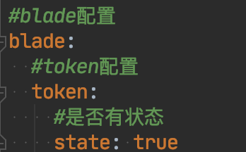
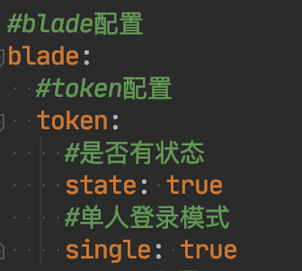
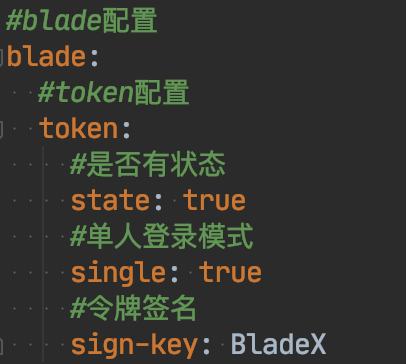

## 前言
* BladeX 默认采用JWT分布式无状态认证的模式，无需配置可直接启动
* 考虑到企业使用中遇到的各种场景，BladeX对Token策略进行了改良，可以通过配置开启有状态认证的模式
* 通过巧妙设计，开启有状态配置后，会将Token保存在Redis中，在无状态认证的环节加上一层redis认证的步骤
* 在分布式部署的场景下，无需再做任何配置，所有Token都将保存至Redis服务中，可以配置一个账号登录多人也可以配置一个账号只可一人登录
* BladeX 的Token策略切换，整个流程都是无感知的，大家只需延续以往的开发习惯即可

## 状态配置
* Token默认为无状态，配置如下

* 若需要配置为有状态，只需将state的值改为true

## 在线配置
* 开启有状态认证后，可以配置一个账号可以登录多人还是单人，具体如下

## 签名配置
* JWT加密生成Token的时候可以指定一个签名，默认为BladeX，也可以自行配置，具体如下

## 踢出登录
* 对于一些需要踢人的场景，可以使用框架内置的API进行操作
`JwtUtil.removeAccessToken(String tenantId, String userId)`
* 若开启了单人模式，则无需配置，框架会默认踢出上一个登录的Token，并生成新的Token给新的用户，这个操作俗称：顶号

## 后记
* 想要了解源码逻辑、具体实现请看`blade-starter-jwt`、`blade-starter-auth`、`blade-core-secure`三个组件
* 后续也会更新关于Secure安全框架的源码级解析，敬请期待～
